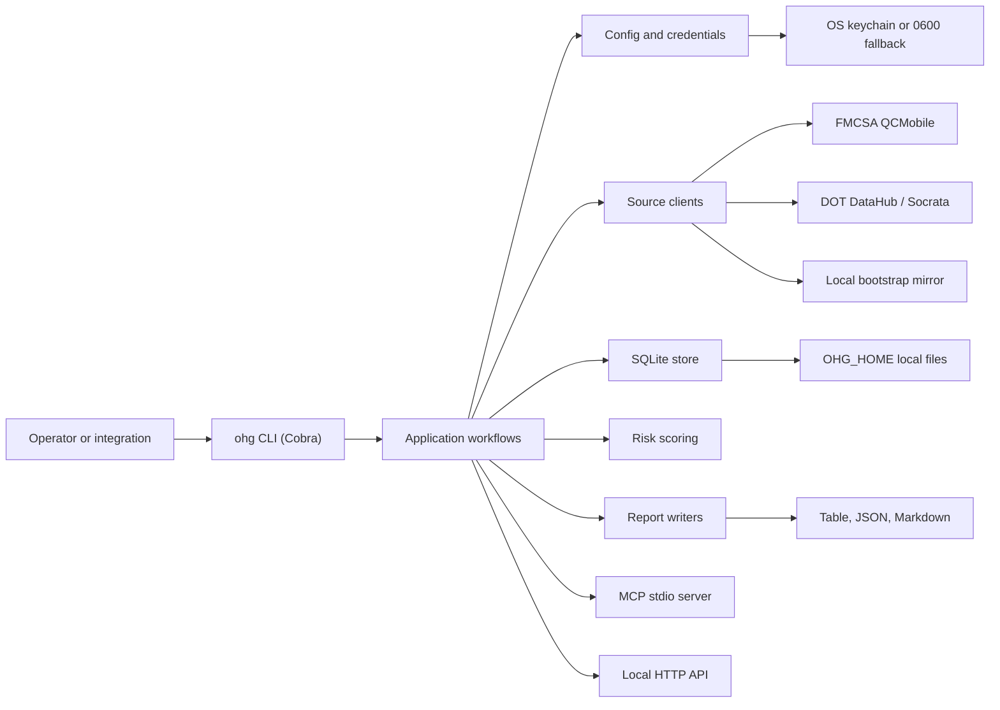
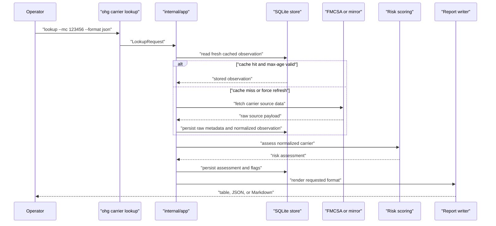

# Architecture

OpenHaul Guard is a local-first Go CLI. The core workflow is: accept a carrier identifier, fetch or reuse source data, normalize it into stable local models, score risk flags, persist observations, and render reports for human review.



## Main Components

- `cmd/ohg`: executable entrypoint.
- `internal/cli`: Cobra command definitions, global flags, and user-facing command wiring.
- `internal/app`: orchestration layer for setup, lookup, diff, watchlist, mirror, packet, MCP, and HTTP workflows.
- `internal/config`: default config, TOML loading, environment overrides, and local directory layout.
- `internal/credentials`: secret storage abstraction using the OS keychain when available.
- `internal/sources`: network and local source clients.
- `internal/normalize`: conversion from source-specific payloads into domain models.
- `internal/scoring`: deterministic risk flags, evidence, and recommendations.
- `internal/store`: SQLite persistence and migrations.
- `internal/report`: table, Markdown, and JSON report rendering.
- `internal/packet`: text and PDF carrier packet extraction and comparison.
- `internal/mcp`: local MCP JSON-RPC server over stdio.
- `internal/httpapi`: local HTTP API for trusted backend integrations.

## Lookup Data Flow



## Local State

By default, local state lives under `~/.openhaulguard`. Operators can override this with `OHG_HOME` or `--home`.

Typical layout:

```text
~/.openhaulguard/
  config.toml
  ohg.db
  raw/
  reports/
  logs/
  mirror/carriers.json
```

The SQLite database stores normalized carrier observations, risk assessments, setup state, packet checks, and watchlist entries. Raw source metadata and reports stay local unless an operator exports or shares them.

## Integration Surfaces

- CLI commands are the primary interface and should stay scriptable with stable JSON output.
- The HTTP API is intended for same-host backend integrations. It binds to loopback by default and should use a token before non-loopback binding.
- The MCP server is a developer-preview stdio integration surface for local assistants and tools.
- Watchlist operations are intentionally pull-based. Use scheduled `watch sync`, `watch report --format json`, and `watch export --format json` jobs instead of relying on hosted webhooks.

## Design Constraints

- Local-first: no hosted service is required for normal CLI operation.
- Human review: OpenHaul Guard provides evidence and flags, not tendering decisions or carrier blacklists.
- Secret minimization: credentials should not appear in reports, logs, raw metadata, or public issues.
- Deterministic reports: JSON output should remain suitable for automation and regression tests.
- Conservative dependencies: prefer standard library and small, well-maintained packages for a CLI footprint.
